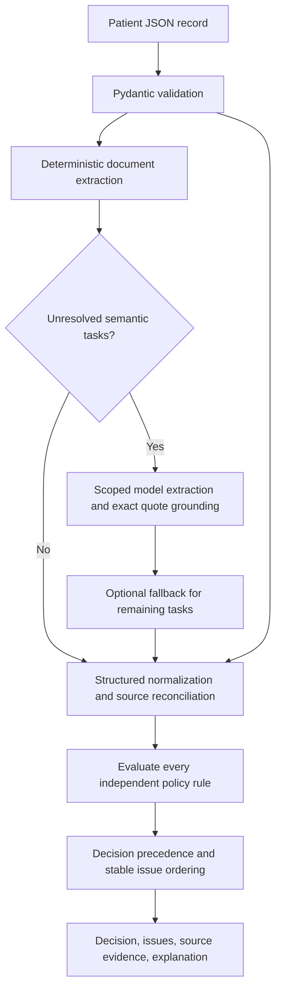

# Pre-Op Scheduling Triage

Evaluate one patient submission against the supplied Cadence policy. The function returns a decision, every independent blocker, and exact source evidence. Python applies clinical policy; an LLM extracts unresolved semantic facts only.

**This repository is the take-home submission to Cadence.** A “patient submission” means a patient JSON record passed into the program. The 50 supplied examples are enough to run and evaluate it; you do not need to create your own patient submission file.

## Run and visually inspect the results

Start with the terminal report viewer—it shows each patient submission alongside its decision, evidence, and expected result. Follow these steps to generate and open the report.

Requires Python 3.11+ and `uv`. Dependencies are declared in `pyproject.toml` and locked in `uv.lock`.

### 1. Open Terminal and enter the project

```bash
cd /Users/krishjana/Desktop/preop-exercise
uv sync --locked
```

If you cloned the repository somewhere else, use that directory in the `cd` command.

### 2. Add your API key

Create a `.env` file in the project directory:

```bash
nano .env
```

Paste this, replacing the placeholder with your actual key:

```dotenv
OPENAI_API_KEY=your_actual_api_key_here
```

Save with **Control+O → Enter**, then exit with **Control+X**. `.env` is already gitignored. The `UV_ENV_FILE=.env` prefix below tells `uv` to load the key for that command; the application does not automatically load `.env` itself.

### 3. Run the tests and generate the report

Run these commands in order:

```bash
make test
UV_ENV_FILE=.env make baseline
make evals-local
make score
UV_ENV_FILE=.env make determinism
make report
```

The current expected results are **130 passing tests**, **100% local score**, and **100% exact replay stability**, as recorded in the [validation results](docs/validation.md). The sample inputs resolve deterministically, so these results do not verify your API key or live model extraction. Unit tests mock extraction and never call live models. Model-backed ambiguous inputs need separate live evaluation.

| Command | What it does |
| --- | --- |
| `make test` | Runs the synthetic unit tests for parsing, policy, extraction routing, and failures. |
| `UV_ENV_FILE=.env make baseline` | Processes all 50 sample records and writes decisions and evidence to `data/baseline_outputs.jsonl`. |
| `make evals-local` | Compares outputs against the supplied labels and writes `data/eval_report.json`, using the supplied evaluator's schema, decision, and issue-category checks. |
| `make score` | Prints the aggregate local score; the expected value is `100.0`. |
| `UV_ENV_FILE=.env make determinism` | Repeats the default patient record ten times and writes stability metrics to `data/determinism_report.json`. |
| `make report` | Opens the terminal viewer for the local evaluation report. |

### 4. Inspect the report

Use a wide terminal to see the patient input alongside the result pane, which compares actual and expected decisions and issue categories. Select records in the list with the arrow keys or mouse, then read each issue's source evidence to see why it was raised. To filter failures, focus the metrics table using **Tab** or a click, select a metric, and press **f**; press **f** again on that metric to clear the filter. Press **q** to quit.

To inspect the replay metrics separately:

```bash
python3 -m json.tool data/determinism_report.json
```

### Optional configuration

You can run the supplied sample walkthrough without a key: skip step 2 and omit `UV_ENV_FILE=.env` from the baseline and determinism commands. Unresolved required document meaning stays uncertain and produces follow-up when no key is available.

Choose a primary model with `UV_ENV_FILE=.env make baseline MODEL=gpt-4.1-mini`. An optional `PREOP_FALLBACK_MODEL` entry in `.env` enables selective fallback for unresolved semantic tasks, as described below.

`UV_ENV_FILE=.env make evals` runs the original hosted OpenAI Evals workflow and uploads patient submissions to that service. It requires credentials. The walkthrough above uses `make evals-local`, which scores locally without uploading records.

## Public interface

```python
from core import Decision, IssueCategory, PatientSubmission, TriageOutput, triage_submission

result = triage_submission(submission, model="gpt-4.1-mini")
print(result.model_dump_json())
```

`core.py` is a compatibility facade. The supplied runners, evaluator, viewer, and dataset remain unchanged. Each issue has `category`, `description`, and `evidence: {source, details}`. The five original category strings are preserved.

## Architecture



`run_baseline.py` reads patient records and calls `core.triage_submission`. The engine validates input, parses document facts, resolves any remaining semantic tasks, then merges them with normalized structured data. Rule evaluation produces the output JSON. `score_local.py` compares that output with the supplied labels through `run_evals.py`; `view_report.py` displays the resulting report. Expected labels are used for evaluation only and never determine the program's decisions.

| Module | Responsibility |
| --- | --- |
| `models.py` | Input/output contracts; preserve all vital values |
| `policy.py` | Supplied windows, thresholds, and issue order |
| `provenance.py` | Source references and KNOWN / MISSING / AMBIGUOUS facts |
| `normalize.py` | Calendar dates, timestamps, lab aliases, Celsius conversion |
| `medication.py` | Brand/generic matching and current-use reconciliation |
| `extraction.py` | Document candidates, signatures, vitals, plan instructions |
| `semantic.py` | Responses API extraction, grounding, selective fallback |
| `facts.py` | Structured fact resolution and measurement selection |
| `rules.py` | Pure policy evaluators |
| `engine.py` | Reconcile facts, collect issues, render output |

Implementation modules live in `preop/`. Policy numbers and operators are explicit constants. The LLM cannot select a decision, add criteria, calculate windows, or convert temperatures. Every rule evaluates independently: a safety exclusion takes precedence without erasing other blockers. Missing date/risk suppress dependent testing conclusions.

## Semantic extraction and routing

Straightforward text uses deterministic parsing. Unusual document meaning, current medication use, management plans, and atypical numeric vitals become scoped tasks. Requests contain only the procedure type and relevant documents, without the entire structured chart or policy. Document text is untrusted data.

The primary model is always the caller's `model` argument. `client.responses.parse` supplies a strict Pydantic schema with no decision field. Every claim needs an in-scope index and a nonempty exact source quote. Plan instructions require separate grounded preoperative and postoperative excerpts. Numeric vital values are checked against quoted numbers; an initial reading cannot conceal an unsupported later recheck.

Optional `PREOP_FALLBACK_MODEL` handles remaining tasks after request/validation failure, unsupported quotes, contradictions, or UNKNOWN results. It receives only outstanding documents and focused contiguous excerpts. Successful primary extraction never invokes fallback. The client has a 30-second timeout and one SDK retry. Expected API failures preserve uncertainty. There is no extraction cache or label-based routing.

The adapter follows the [official Structured Outputs guide](https://developers.openai.com/api/docs/guides/structured-outputs).

## Authority, assumptions, and evidence

- Structured procedure date and risk are authoritative. Narrative targets and procedure names never backfill them.
- Windows compare calendar dates as written, with inclusive endpoints: 30-day H&P/CBC and 14-day high-risk labs pass. Future H&Ps/labs do not satisfy preoperative windows.
- Only final labs count. Error/pending records are filtered before selecting the newest result. LAB-CBC/LAB-CMP are aliases; BMP is never CMP. Lab values add no clinical criteria.
- An H&P must be an actual preoperative evaluation for this procedure. Titles, wellness encounters, and references to reviewed H&Ps are insufficient. Explicit service dates take precedence over upload dates.
- Consent must apply to the procedure and explicitly show a patient signature. Clinician attestation is insufficient. Valid signed consent can coexist with an older unsigned copy.
- Dated, explicit current-use/reconciliation assertions can add or supersede the undated medication snapshot. A historical list or hold command alone does not reactivate an inactive drug. Unknown anticoagulant activity produces missing-data follow-up.
- Warfarin/Coumadin, apixaban/Eliquis, rivaroxaban/Xarelto, dabigatran/Pradaxa, and edoxaban/Savaysa normalize deterministically. Aspirin/ASA and clopidogrel do not trigger this policy.
- Plans match the current drug and procedure and require both preoperative and postoperative instructions. A newer incomplete plan supersedes an older complete one; a newer medication list does not. Deferred recommendations are incomplete.
- BP and temperature use the newest actual measurement across structured records and text, including timed addenda. Flowsheet references do not replace values. Celsius conversion is deterministic. Symptoms and conditional thresholds are not additional exclusions.
- Explicit timestamp offsets normalize to UTC for ordering. Date-only/naive observations use midnight/UTC without inventing precision. Within one note, later text resolves equal-time rechecks. Across sources, simultaneous conflicting values or unknown chronology remain ambiguous.
- Unknown required facts are never guessed. No issues means READY; safety issues mean NOT_CLEARED; other issues mean NEEDS_FOLLOW_UP.

Provenance travels with each fact from extraction through evidence rendering. Evidence retains original values/dates and exact excerpts. Array-index paths correctly reflect the original input; reordering can change those pointers while preserving selected facts and policy outcomes. Identical inputs produce stable issue order and explanations. Debug logging records sources and states without patient identifiers or chart text.

## Verification

`make test` covers boundaries, signatures, document relevance, lab aliases/status, medication switches, uncertain activity, plan completeness, vitals/rechecks, conflicts, grounding, routing, API failures, aggregation, ordering, and immutability. Clinical fixtures are synthetic. Labels are used only through the supplied evaluator as development feedback.

See [validation results](docs/validation.md). Generated outputs and reports are gitignored.

| Variable | Default |
| --- | --- |
| MODEL | gpt-4.1-mini |
| INPUT | data/patients_sample_50.jsonl |
| OUTPUT | data/baseline_outputs.jsonl |
| REPORT | data/eval_report.json |
| DETERMINISM_REPORT | data/determinism_report.json |

## Scope and limitations

This is one synchronous function with one small fixed policy. RAG adds retrieval failure modes without a corpus; Redis adds distributed state without workers; OCR is upstream because text is already supplied. GNNs, learned clearance classifiers, and gradient attribution obscure rules that can be explained directly. Database persistence and workflow infrastructure are unnecessary here.

The medication alias table is bounded; unfamiliar drugs need reviewed mappings or a terminology service. Parsing supports common explicit formats and conservatively routes recognized ambiguous candidates; it cannot establish chart completeness. Quote grounding proves provenance, not semantic truth. Model-backed ambiguous inputs may vary across fresh calls; strict schemas and deterministic rules reduce variability without eliminating it. Invalid input shapes raise Pydantic errors. Expected extraction failures produce follow-up; unexpected programming errors propagate.

Production work would add FHIR/EHR adapters, RxNorm terminology, upstream OCR, durable audits and database persistence, workflow queues, authentication/authorization, PHI controls, observability, human review, policy versioning, and model/prompt version tracking and monitoring.
